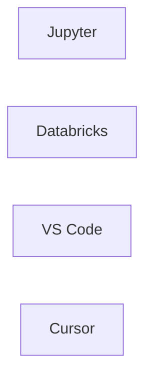

# mermaid-magic

Bring the magic of mermaid diagrams to your favorite coding environment!

Create mermaid diagrams in:
- Jupyter Lab and Jupyter notebooks (classic)
- Databricks Notebooks
- Notebooks (.ipynb) in VS Code
- Notebooks (.ipynb) in Cursor

